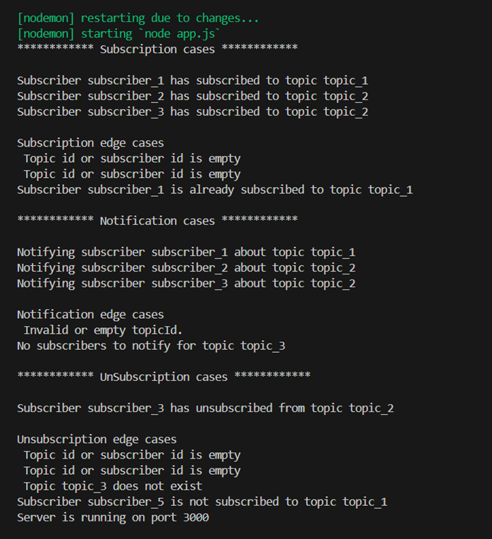
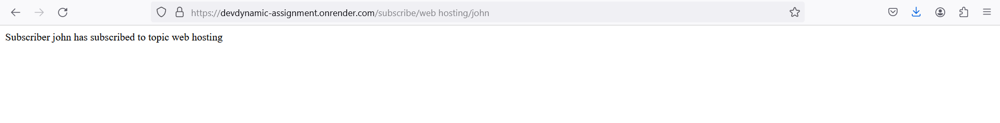
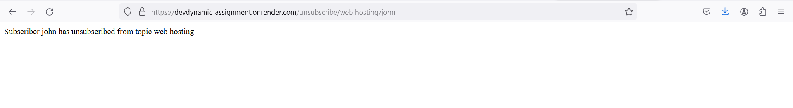
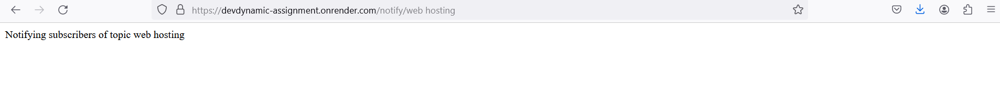

## Problem Statement 1: Implement Publisher Subscriber Notification System
You need to implement a publisher subscriber notification system. A publisher subscriber
notification system contains a topic and subscribers. A topic can be subscribed by multiple
subscribers.

### About the assignment:
**app.js** utilizes the Express.js framework to create a server. It includes routes for subscribing, unsubscribing, and notifying subscribers about topics.The server listens on a specified port for incoming requests.

**driver.js** defines a PubSubscription class responsible for managing topic subscriptions, notifications, and unsubscriptions. It also includes a driver function that demonstrates the usage of the class by subscribing, notifying, and unsubscribing subscribers from topics. This file also exports the PubSubscription class for use in other modules.

Both files collectively provide a functional system for managing pub-sub interactions with error handling for various edge cases.

The provided **postmanjson.json** file contains a collection of HTTP requests for testing the PubSubSystem API endpoints. It includes requests for subscribing, unsubscribing, and notifying subscribers about topics. Each request specifies the method, URL, and any necessary headers.

### Edge cases:
**1.	Subscription:** 
Test cases cover for subscribe are as below
- Empty Topic Id
- Empty Subscriber Id
- Duplicate Subscription

**2.	Notification:**
Test cases cover for notification are as below
- Empty Topic Id
- Non existing topic

**3.	Unsubscription:**
Test cases cover for unsubscription are as below
- Empty Topic Id
- Empty Subscription ID
- Non existing topic
- Non existent subscriber

### Output for driver code:

### Hosting backend server:
The server is hosted by using the render

https://devdynamic-assignment.onrender.com/subscribe/web%20hosting/john

https://devdynamic-assignment.onrender.com/unsubscribe/web%20hosting/john

 
https://devdynamic-assignment.onrender.com/notify/web%20hosting

#### Technologies used : Nodejs, Express
#### Version control : git
#### IDE: VSCode
#### API testing: Postman
#### Hosting platform : Render

### Some optimization techniques for this problem statement are

**1)	Load Balancing using NGINX**
Set up NGINX as a reverse proxy to distribute incoming requests across multiple instances of your Node.js application running on different ports or servers. This can be achieved by configuring NGINX's upstream directive in its configuration file.

**2)	Implementing Efficient Caching:**
Use caching mechanisms like Redis or Memcached to store frequently accessed data in memory, reducing the need to query the database repeatedly. This can significantly improve response times for certain types of requests

### My learning:
Implementing a Publisher Subscriber Notification System fosters understanding of pub-sub architecture, error handling, and class implementation. Utilizing Express.js for server creation enhances HTTP request handling efficiency, while Postman aids in API testing and Git enables version control, ensuring code integrity. Deployment on Render showcases real-world application hosting, enriching knowledge of cloud platforms and deployment processes.

